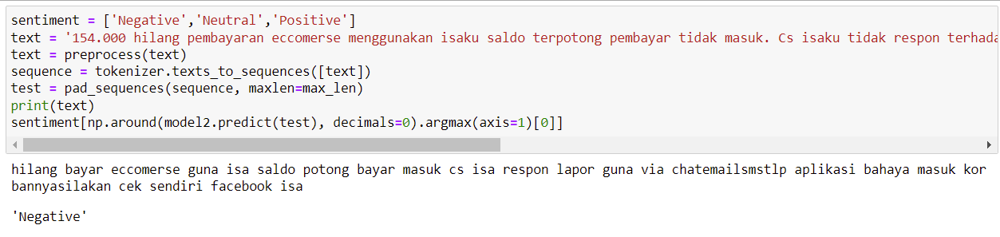
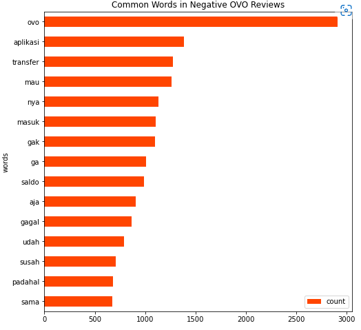

# E-Wallet Sentiment Analysis with Long Short-Term Memory (LSTM)
A sentiment analysis of e-wallet (DANA, Link Aja, and OVO) reviews on Google Play Store and Apple App Store using LSTM model.

## Introduction
This project is done to complete the final exam of my university course called 'Kapita Selekta Analitikal Data'. The purpose of this project is to identify which e-wallet has the most positive sentiment on both app store, identify the difference of reviews sentiment on Google Play Store and Apple App Store, find the most discussed review topics, and to test the accuracy of the LSTM model. 

The dataset contains 25616 rows of reviews from 3 e-wallet and both app store. The data is collected using python package (https://github.com/cowboy-bebug/app-store-scraper) and (https://github.com/JoMingyu/google-play-scraper). The sentiment of the data is labelled using 2 methods, the first one is using the rating of the review as the label and the other one is using an Indonesian sentiment lexicon (https://github.com/fajri91/InSet). The data is then analysed using the same LSTM model to both labelling methods. The last thing to do is creating a visualization of the data based on the best labelling method.

## Results

The result of both models are as below. Model 1 and 2 has the exact same LSTM model but the only difference is the label, model 1 uses sentiment label from review ratings while model 2 uses sentiment label from the Indonesian sentiment lexicon.

Model 1 Test Accuracy

Model 1 Training Loss

Model 2 Test Accuracy

Model 2 Training Loss

The result above shows that the test accuracy of Model 2 is slightly better than model 1 but the loss are much better than model 1. Eventhough both model is still overfitting, we could clearly see that the training loss graph of model 2 is better.

  

Model 1 in analysing positive sentiment

Model 2 in analysing positive sentiment

Based on the test using review data from another e-wallet in the app store, model 1 predicted the wrong sentiment while model 2 predicted the correct sentiment. We could see that model 2 perform better in analyzing the positive sentiment.

  

Model 1 in analysing negative sentiment

Model 2 in analysing negative sentiment

Using a different review data from another e-wallet in the app store, both model predict the correct sentiment therefore both models could perform well in analyzing negative sentiment.

  

Since model 2 perform better in almost every aspect, the following visualization is based on the sentiment label of model 2.

  

 E-Wallet Sentiment Comparison on both app store 
 

So the e-wallet that has the best sentiment on both app store is Dana with 45.47% of positive reviews which is quite a huge difference compared to OVO and Link Aja.

  

 Sentiment Comparison in Google Play Store and Apple App Store 
 

The difference between the review sentiment on Apple App Store and Google Play Store is not that significant but the reviews on Apple App Store tend to be more positive than Google Play Store.

  

 Dana Most Common Review Topics
 

Users tend to compliment the transaction system and transfer system of Dana, while for the complaints, the most common topics are about problems when users top up their wallet, and problmes when they want to log in to the app.

  

 OVO Most Common Review Topics
 

Users tend to compliment the transaction system and transfer system of OVO, while for the complaints, the most common topics are about problems when users do a transfer, problems or bug about their balance on the OVO wallet, and problmes when they want to log in to the app.

  

 Link Aja Most Common Review Topics
 

Users tend to compliment the transaction system and transfer system of Link Aja, while for the complaints, the most common topics are about problems when users top up their wallet, problems or bug about their balance on the Link Aja wallet, and problmes when they want to log in to the app.

